# Getting Started

> **Note**: Make sure you have completed the [Set Up Your Environment](https://reactnative.dev/docs/set-up-your-environment) guide before proceeding.

## Step 1: Start Metro

First, you will need to run **Metro**, the JavaScript build tool for React Native.

To start the Metro dev server, run the following command from the root of your React Native project:

```sh
npm start

# OR using npx
npx react-native start
```

## Step 2: Build and run your app

With Metro running, open a new terminal window/pane from the root of your React Native project, and use one of the following commands to build and run your Android or iOS app:

### Android

```sh
# Using npm
npm run android

# OR using npx
npx react-native run-android
```

# Changes Added in current repo

- Sign In
- Sign Up
- Dummy dashboard Page (To handle logout button)
    - This screen also includes latest 4 expenses
- Transactions (Expense) Screen
    - Empty Screen (If no expenses are added) 
    - List expenses
    - Add/Edit expense
- Category
    - Added default categories for each user on sign up
    - Add category

# Changes not Included

- Update category
- Session management (on app close)
- User settings
- Filters for category and expenses
- Delete categories & expenses
- Actual Dashboard page (dynamic)

# Decisions Made

- I chose Watermelon DB to store category & expense data instead of AsyncStorage
    - This gives me edge on rendering dynamic data using observers which eliminated the use of redux (As this is still a small application)
- Considering ther app size and pages, I decied to go for context instead of Redux for avoid pro drilling problem 
- AsyncStorage is only used to store logged in user session (basic username password session)
- Because of limited time, I haven't made all working functionalities but have added validations on basic places as much as possible

# Tradeoff for this setup

- Since there are very limited services built as this as build keeping offline in mind, there is very likely change of rework of services while scaling the application
- Because of limited time could not do delet/edit functionalities


## 📸 App Screenshots

### 🔐 Sign Up

| Screen | Preview |
|------|--------|
| Create Account (Dark) | 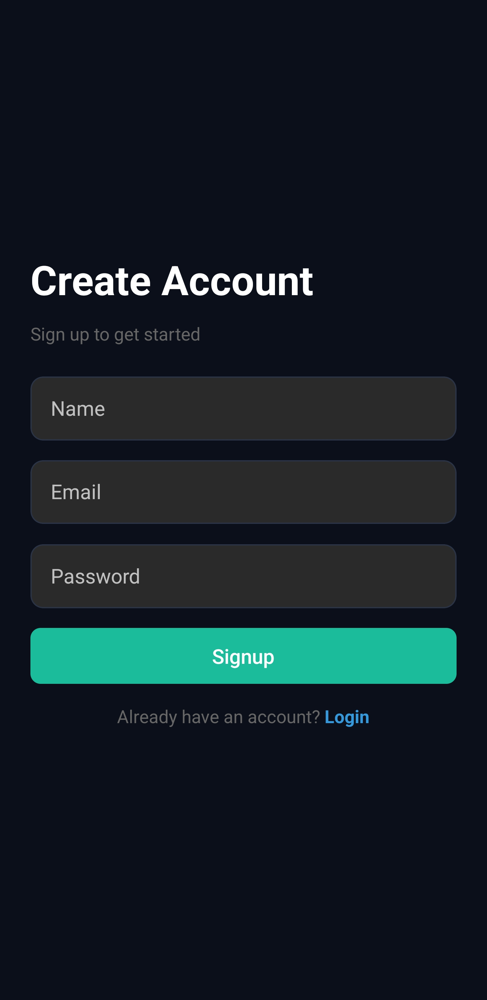 |
| Create Account (Light) |  |

---

### 🔑 Login

| Screen | Preview |
|------|--------|
| Login (Dark) | 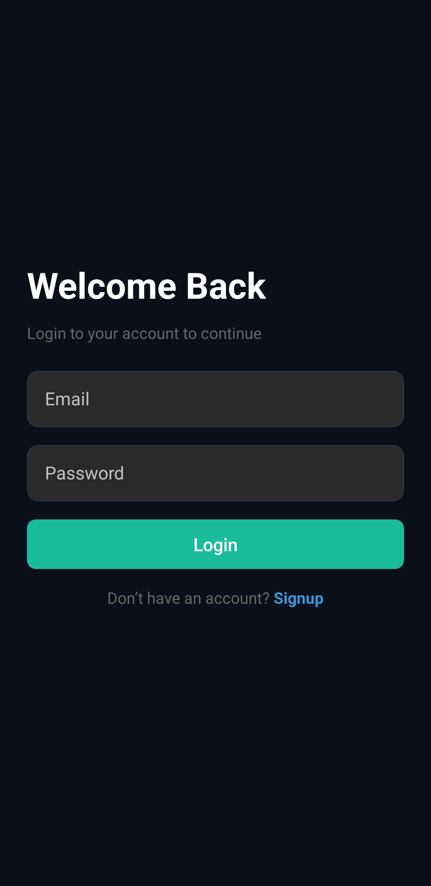 |
| Login (Light) | 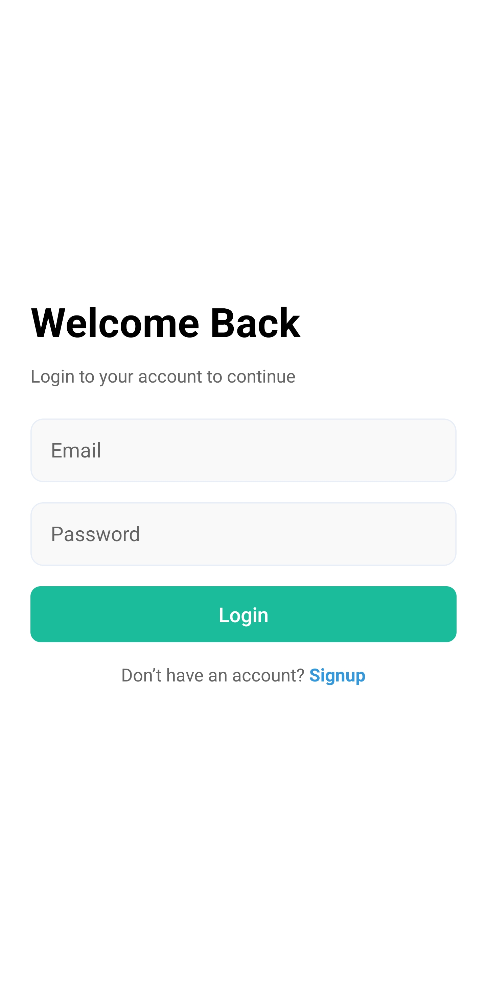 |

---

### 📊 Dashboard

| Screen | Preview |
|------|--------|
| Dashboard (Dark) | 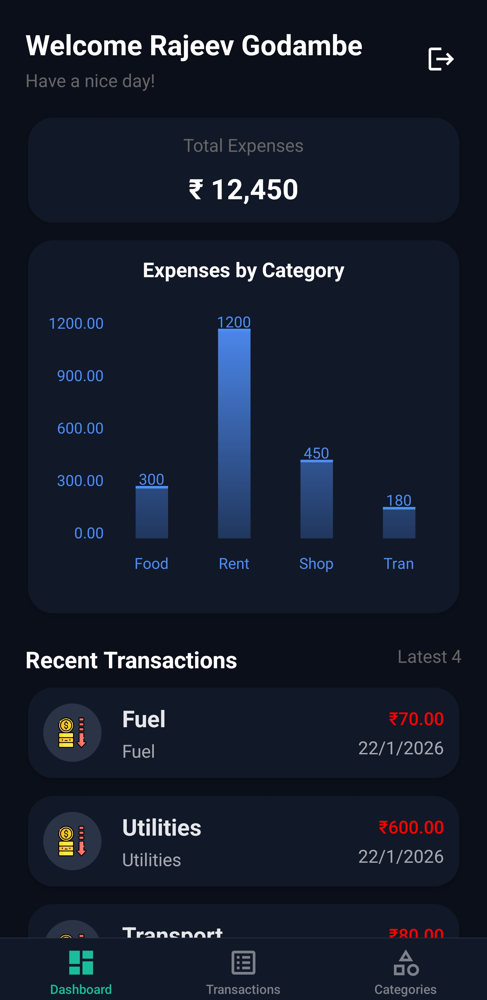 |
| Dashboard (Light) | 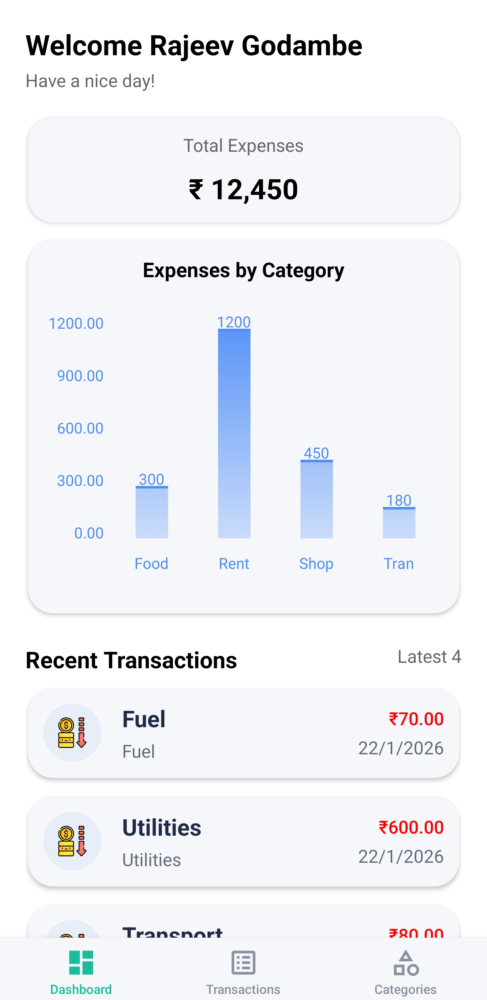 |

---

### 🗂️ Category

| Screen | Preview |
|------|--------|
| Category List | 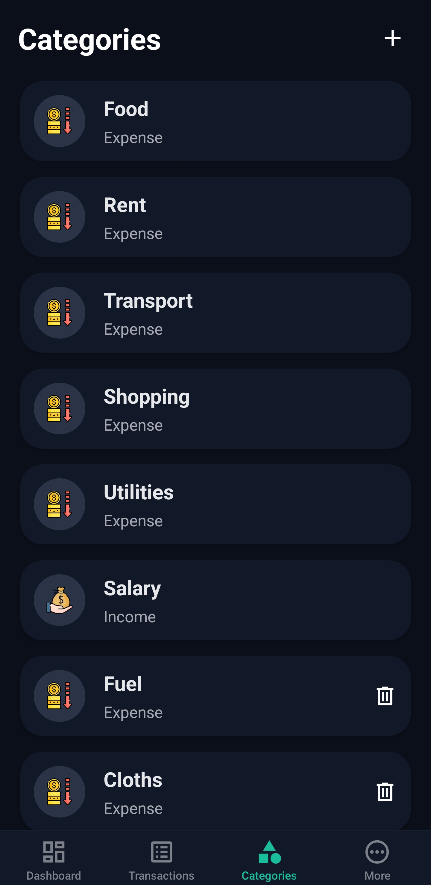 |
| Add Category | 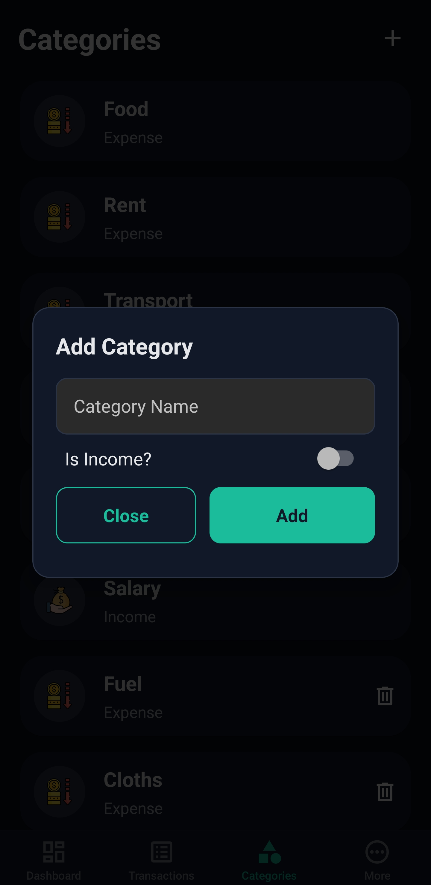 |

---

### 💸 Expenses

| Screen | Preview |
|------|--------|
| Expenses List | 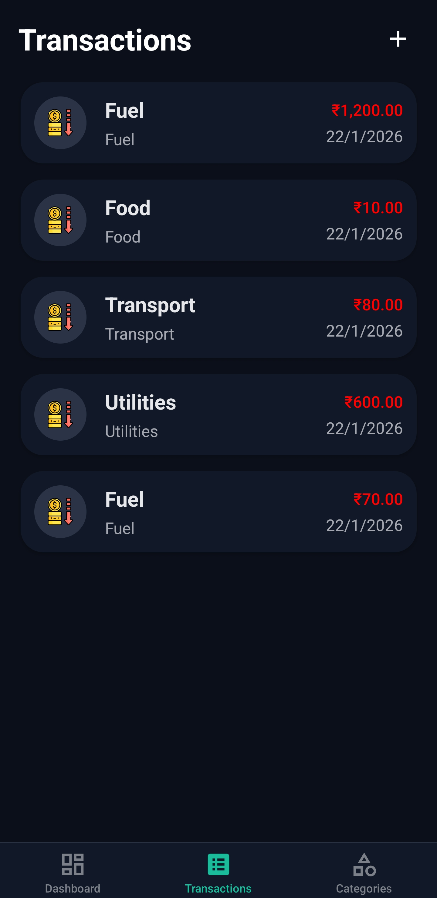 |
| Add Expense | 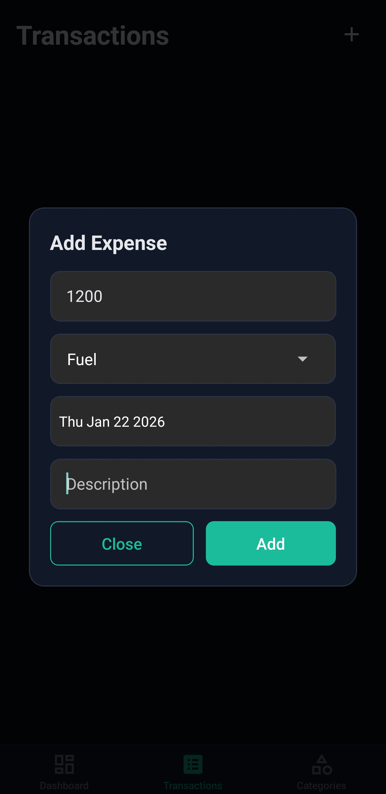 |
| Add Expense Error | 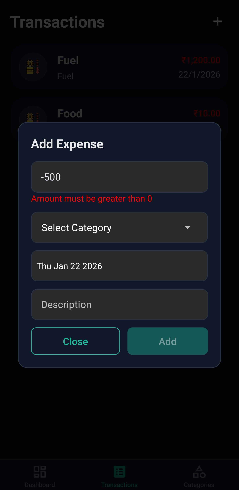 |

---

### 🧪 Misc

| Preview |
|--------|
| 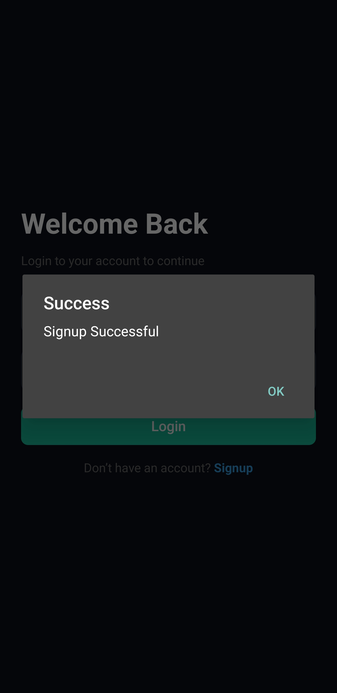 |
| 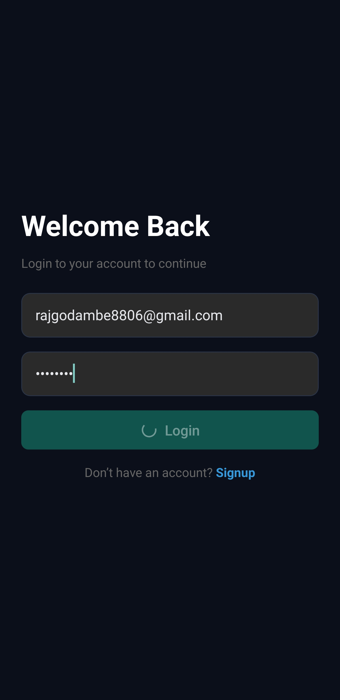 |
| 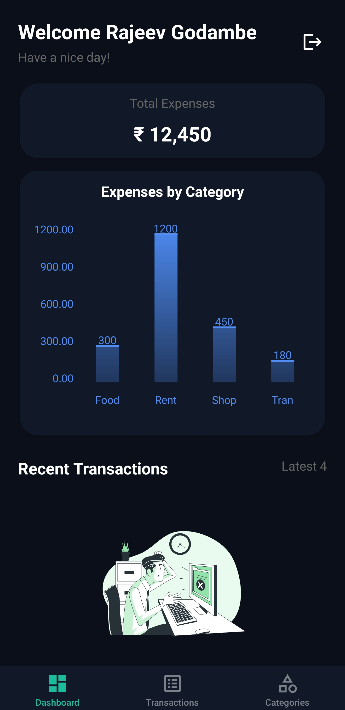 |
| 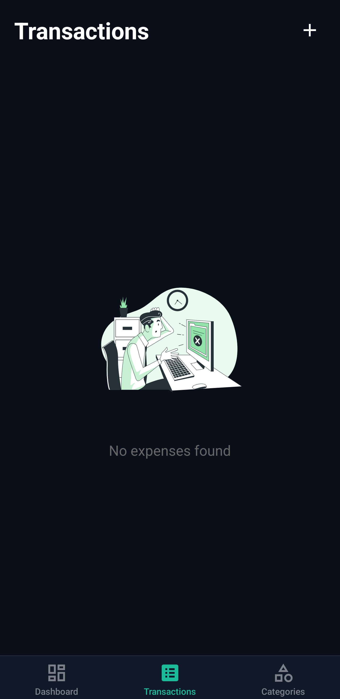 |
| 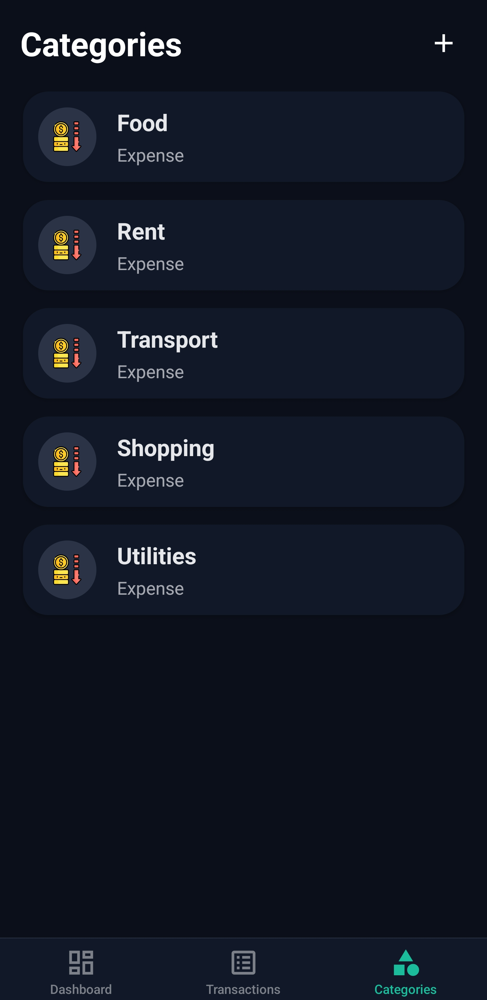 |
| 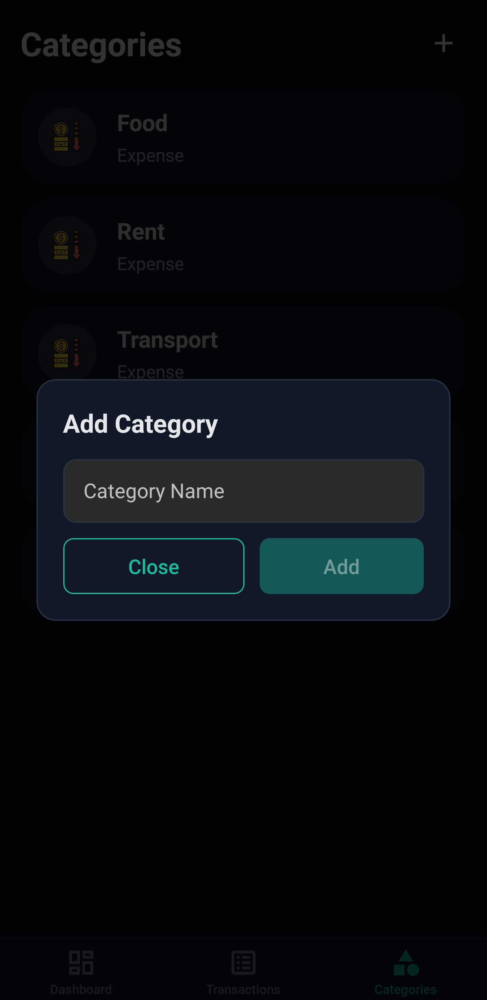 |
| 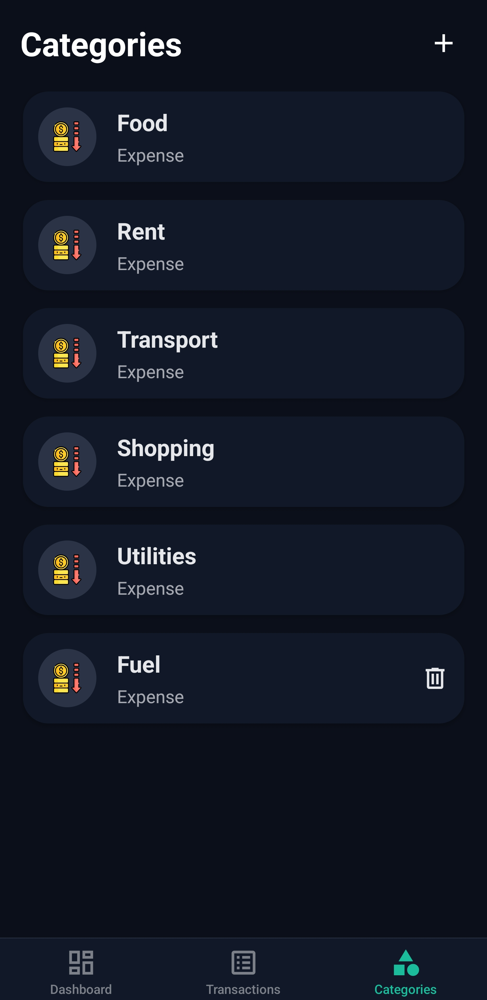 |
| 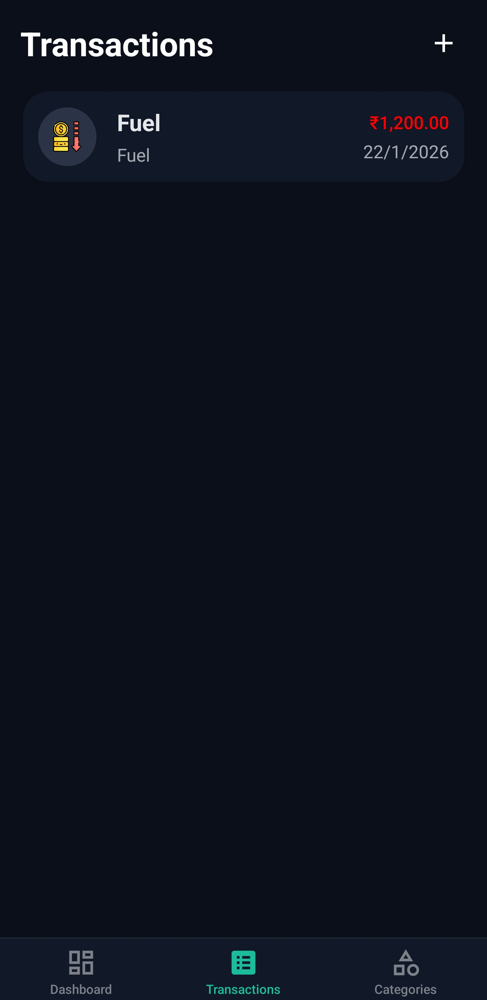 |
| 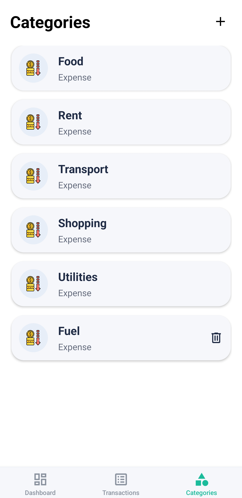 |
| 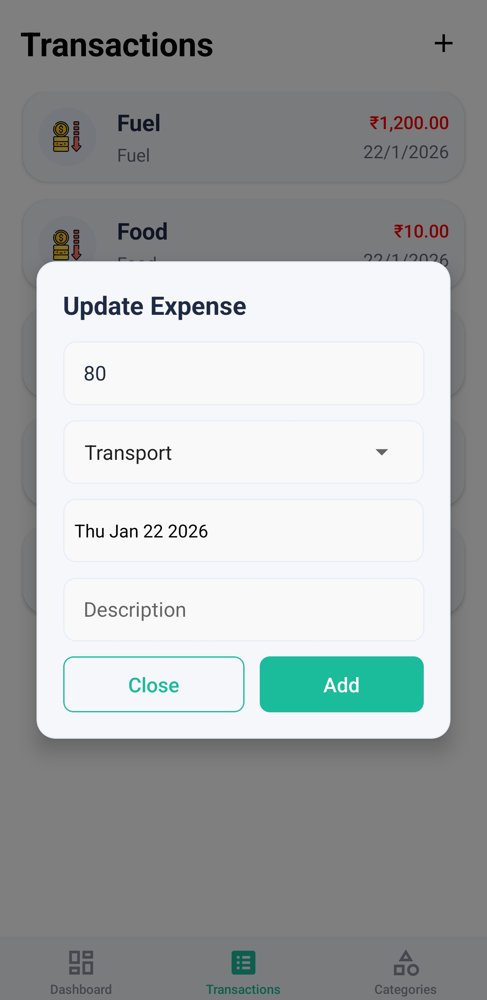 |


## 🎥 App Demo Video

<video width="450" height="450" controls>
  <source src="screenshots/app_demo.mp4" type="video/mp4">
  Your browser does not support the video tag.
</video>
